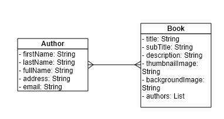

# Back-end Application using Spring Boot - Book Management

## Prerequisite Condition
- Docker is installed

## Technologies are used in the project
1. Spring Boot version ``2.2.6``
2. MongoDB version ``4.2``
3. Maven to manage dependency and build project
4. Code quality assurance with PMD
5. Libraries: Lombok ``1.18.12``, mapstruct ``1.4.1``, swagger ``1.6.0``
6. Validate: javax.validation ``2.0.1``

## Business Rules
1. Implement CRUD API.
2. Allows to filter book by author name (full name).
3. Delete (Soft delete) all books after deleting author.
4. Customise error messages and properties to allow front-end to access an error message should be shown
 corresponding to the field name.

## Diagram


## How to start project
- Step 1. Start Docker

- Step 2. Start docker-compose.xml file under the core-api module.
``
docker-compose up
``

- Step 3. Build Project
``
mvn clean install
``

- Step 4. Run the BookServiceApplication and check the result on port 8080

## Test Coverage - ``80%``
- In this project, I'm writing both integration tests ``MockMvc`` and mock tests ``Mockito``.

## Code Quality - ``Passed``

## API List
- You can also check APIs documentation on this URL after project is started.
``http://localhost:8080/book-service/swagger-ui.html``

### 1. Book
- GET /books/filter : Get all books applied paginate and filter conditions
- GET /books/{id} : Get book by ID
- POST /books : Add new book
- PUT /books/{id} : Update a book by ID
- DELETE /books/{id} : Delete a book by ID

### 2. Author
- GET /authors/{id} : Get author by ID
- POST /authors : Add new author
- PUT /authors/{id} : Update an author by ID
- DELETE /authors/{id} : Delete an author by ID

## Project Structure
```bash
├───core-api
│   ├───codequality: Code quality result after running PMD
│   ├───data: MongoDB will point to this folder to store data
│   ├───src
│   │   ├───main
│   │   │   ├───java
│   │   │   │   └───com
│   │   │   │       └───ntatvr
│   │   │   │           └───core
│   │   │   │               ├───aggregation: Build mongo query
│   │   │   │               ├───config: Libraries configuration
│   │   │   │               ├───controllers
│   │   │   │               │   ├───converter: Using MapStruct to convert request to entity and vice versa
│   │   │   │               │   ├───request
│   │   │   │               │   └───validate
│   │   │   │               ├───exceptions: Exception Handler
│   │   │   │               ├───helps
│   │   │   │               ├───repositories
│   │   │   │               └───services
│   │   │   │                   ├───filter
│   │   │   │                   └───impl
│   │   │   │               └───BookServiceApplication.java
│   │   │   └───resources
│   │   └───test
│   │       ├───java
│   │       │   └───com
│   │       │       └───ntatvr
│   │       │           └───core
│   │       │               └───controllers: Integration Tests
│   │       │               └───services: Mock Tests
│   │       └───resources
│   └───target
│       ├───classes
│       │   └───com
│       │       └───ntatvr
│       │           └───core
│       │               ├───api: All files are generated by OpenAPI
├───core-domain
│   ├───codequality: Code quality result after running PMD
│   ├───src
│   │   └───main
│   │       └───java
│   │           └───com
│   │               └───ntatvr
│   │                   └───domain
│   │                       └───entities
│   │                           ├───author
│   │                           └───book
└───external-image: Contains Diagram 
```
